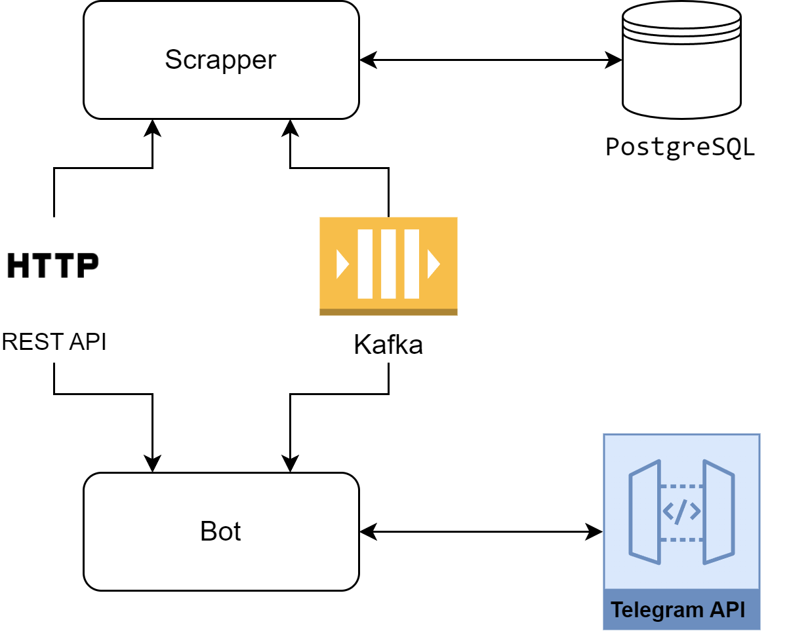

# Link Tracker

## Описание проекта ##
Приложение для отслеживания обновлений контента по ссылкам.
При появлении новых событий отправляется уведомление в Telegram.

Проект написан на `Java 21` с использованием `Spring Boot 3`.

Проект состоит из 2-х приложений:
* Bot
* Scrapper

Для работы требуется БД `PostgreSQL`. Присутствует опциональная зависимость на `Kafka`.

Отслеживание изменений происходит для вопросов на `StackOverflow` и репозиториев `GitHub`:
+ Для вопроса `StackOverflow` отправляется уведомление при обновлении вопроса и при добавлении новых ответов.
+ Для репозитория `GitHub` присылается уведомление при обновлении репозитория и при добавлении новых `Pull Request`.

Управление подписками (ссылками) происходит через чат с ботом в `Telegram`. 
Бот поддерживает следующие команды:
- `/start` -- Регистрация пользователя
- `/list` -- Вывести список отслеживаемых ссылок
- `/track` -- Отслеживать изменения по ссылке <url>
- `/untrack` -- Прекратить отслеживание изменений по ссылке <url>
- `/help` -- Вывести список доступных команд

### Сценарий работы ###
Сценарий использования выглядит следующим образом:
+ Пользователь регистрируется в боте
+ У пользователя есть возможность написать в бота и добавить или удалить ссылку для отслеживания, например

```
/track https://stackoverflow.com/questions/14220321/how-do-i-return-the-response-from-an-asynchronous-call
```
+ При новых изменениях в чат отправляется уведомление:
```
Обновление ссылки https://stackoverflow.com/questions/14220321/how-do-i-return-the-response-from-an-asynchronous-call:

Обновление ответов:

Добавлен новый ответ:

Ссылка: https://stackoverflow.com/questions/14220321/#77817400
Дата: 2024-01-15 02:20
--------------------------------------------------------------------------------

Добавлен новый ответ:

Ссылка: https://stackoverflow.com/questions/14220321/#67648397
Дата: 2021-05-22 10:24
--------------------------------------------------------------------------------

Добавлен новый ответ:

Ссылка: https://stackoverflow.com/questions/14220321/#76444898
Дата: 2023-06-10 05:46
--------------------------------------------------------------------------------
```

```
Обновление ссылки https://github.com/AntonioRusan/LinkTracker:

Обновление Pull Requests:

Добавлен новый Pull Request:
Hw5 - Добавление домена
Ссылка: https://github.com/AntonioRusan/LinkTracker/pull/5
Дата: 2024-03-17 02:27
--------------------------------------------------------------------------------

Добавлен новый Pull Request:
Hw5 bonus - бонусное задание к Дз5
Ссылка: https://github.com/AntonioRusan/LinkTracker/pull/6
Дата: 2024-03-19 06:51
--------------------------------------------------------------------------------

Добавлен новый Pull Request:
Hw6 - добавление jpa и настройки databaseAccessType
Ссылка: https://github.com/AntonioRusan/LinkTracker/pull/7
Дата: 2024-03-27 12:51
--------------------------------------------------------------------------------
```
### Схема системы ###
Сервисы будут общаться между собой как напрямую по `HTTP` через `REST API`, так и асинхронно через очередь сообщений `Apache Kafka`. 
Для хранения данных будет использоваться СУБД `PostgreSQL`.



В проекте реализованы следующие способы доступа к базе данных:
+ JDBC (JdbcClient)
+ JPA (Hibernate)
+ JOOQ

Для выбора конкретного инструмента необходимо задать настройку `database-access-type`.

Для подключения очереди сообщений Kafka необходимо задать параметр `use-queue`.

Также имеется возможность настроить механизм повторного запроса (retry) для всех HTTP-клиентов.

Есть возможность отслеживать метрики приложений `Bot` и `Scrapper` из `Grafana` 
(в том числе отслеживается количество обработанных Telegram ботом сообщений от пользователей).

Проект покрыт тестами `JUnit` и `Mockito`, а также имеются интеграционные тесты с использованием библиотеки `TestContainers`.
